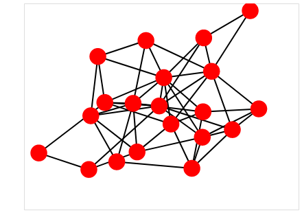
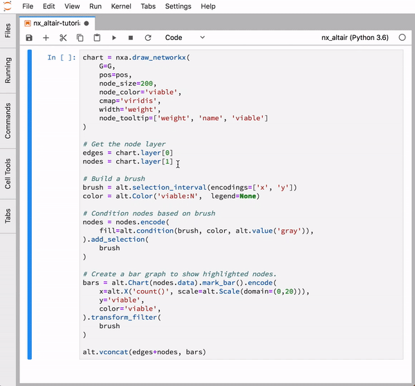
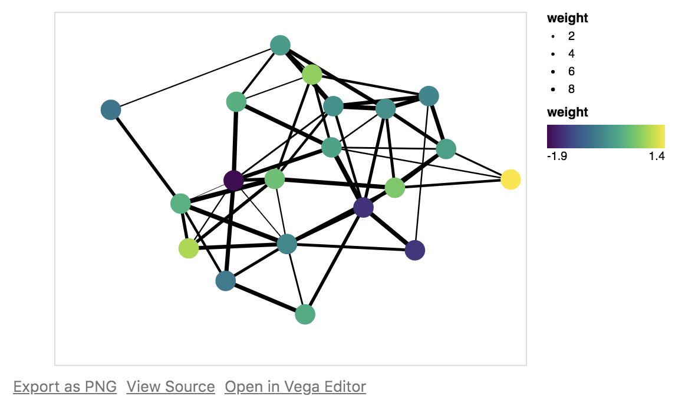

# nx_altair

*Draw NetworkX graphs with Altair*

[](https://gitter.im/nx_altair/Lobby?utm_source=share-link&utm_medium=link&utm_campaign=share-link)

**nx_altair** offers a similar **draw** API to NetworkX but returns Altair Charts instead.

If you'd like to contribute, join the [Gitter chatroom](https://gitter.im/nx_altair/Lobby?utm_source=share-link&utm_medium=link&utm_campaign=share-link) and share your ideas! Also, checkout the [to-do list](#todo-list) below.

## Examples

If you'd like to start playing with nx_altair, download [this notebook](examples/nx_altair-tutorial.ipynb)!

### Simple graph

```python
import networkx as nx
import nx_altair as nxa

# Generate a random graph
G = nx.fast_gnp_random_graph(n=20, p=0.25)

# Compute positions for viz.
pos = nx.spring_layout(G)

# Draw the graph using Altair
viz = nxa.draw_networkx(G, pos=pos)

# Show it as an interactive plot!
viz.interactive()
```



### Leverage Altair




### Customize the visualization

**nx_altair** also supports many of the same arguments from NetworkX for styling your network--with an Altair twist! Map visualization attributes in a declarative manner.

```python
import numpy as np

# Add weights to nodes and edges
for n in G.nodes():
    G.nodes[n]['weight'] = np.random.randn()

for e in G.edges():
    G.edges[e]['weight'] = np.random.uniform(1, 10)


# Draw the graph using Altair
viz = nxa.draw_networkx(
    G, pos=pos,
    node_color='weight',
    cmap='viridis',
    width='weight',
    edge_color='black',
)

# Show it as an interactive plot!
viz.interactive()
```



## Install

To install from PyPI:

```
pip install nx_altair
```

To install for development, clone this repos and install using pip
```
pip install -e .
```

## Contributing

We welcome pull requests! If you find a bug, we'd love for you to submit a PR. If you're not sure how to do that, check out this [simple guide](https://github.com/Zsailer/guide-to-working-as-team-on-github).

If you have a feature request, please open an issue or submit a PR!

## Todo list

A list of things to-do (good ideas for PRs).

- [ ] Add `draw` method that mirrors networkx (easy)
- [ ] Node color scale vmix, vmax (easy)
- [ ] Edge color scale vmix, vmax (easy)
- [ ] Node labels (medium)
- [ ] Edge labels (medium)
- [ ] Mouse-hover interactivity (medium)
- [ ] Arrows for edges (hard)
- [ ] Support for large (>1000 edge) networks (hard)
- [ ] Force-directed interactivity (very hard---beyond altair's current support).
